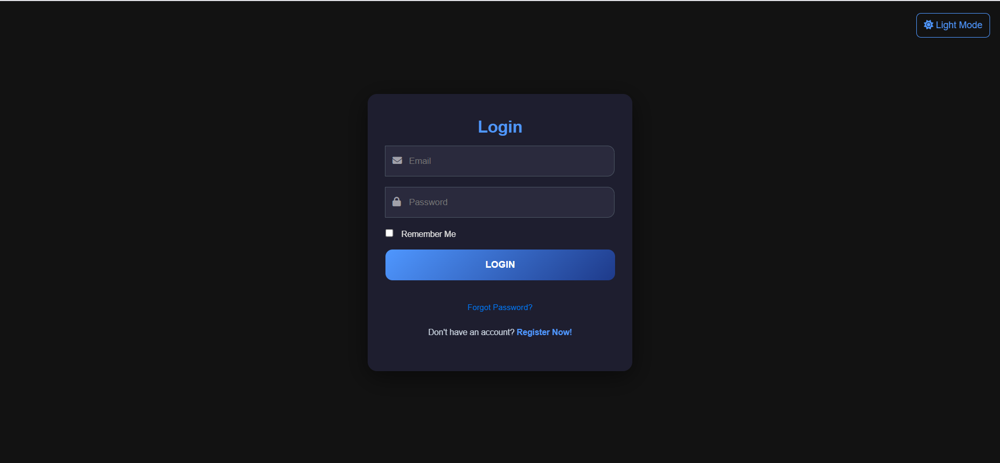
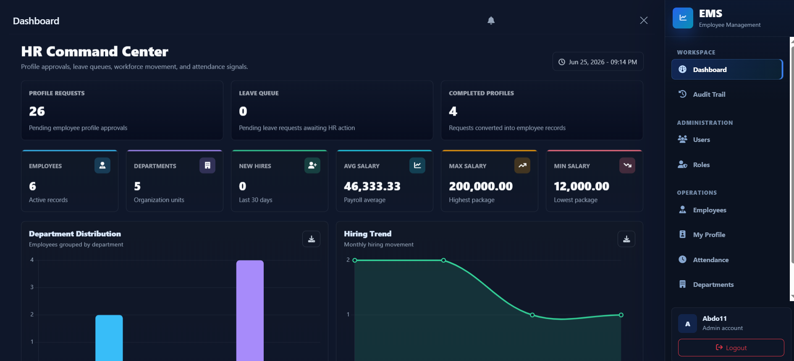
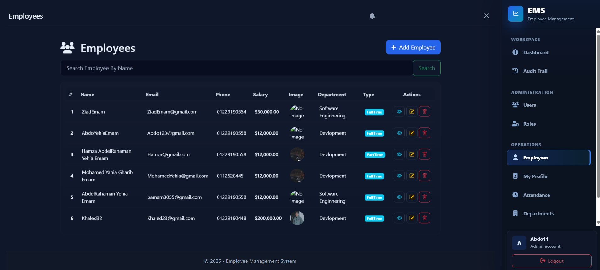
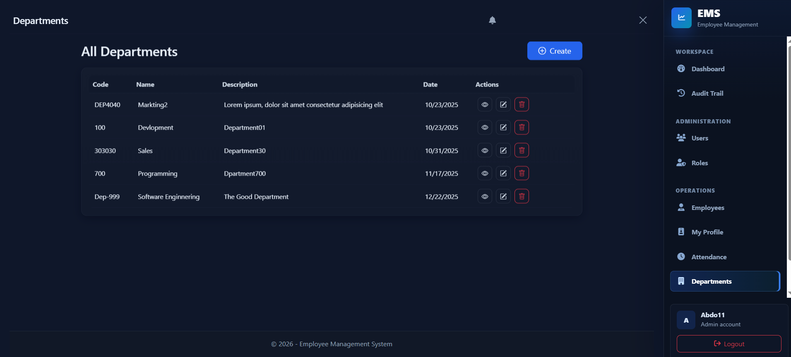
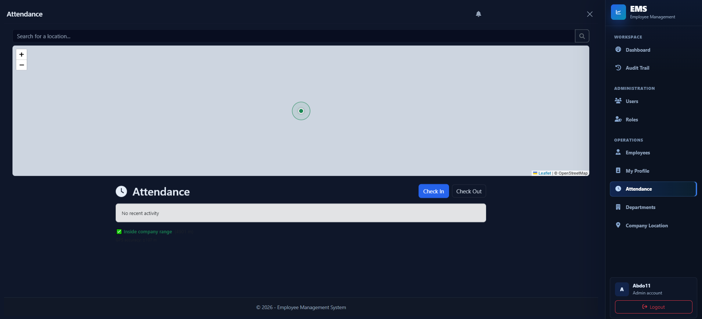
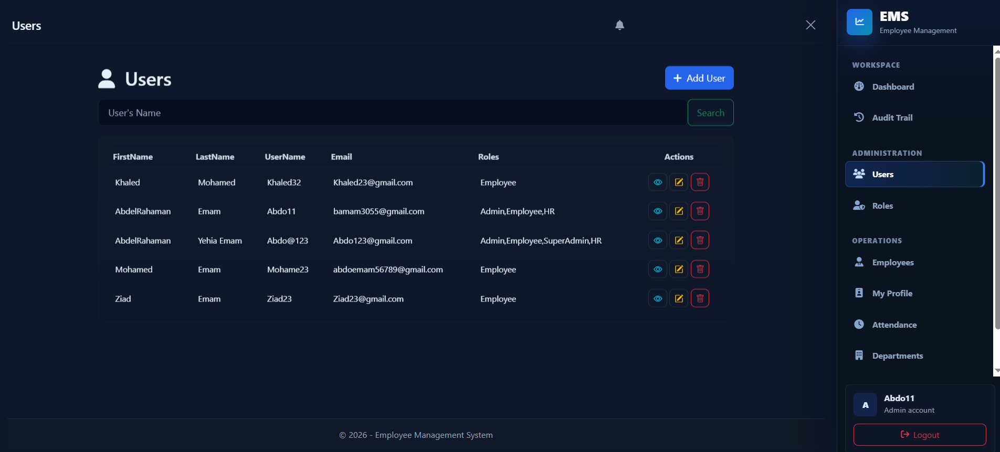
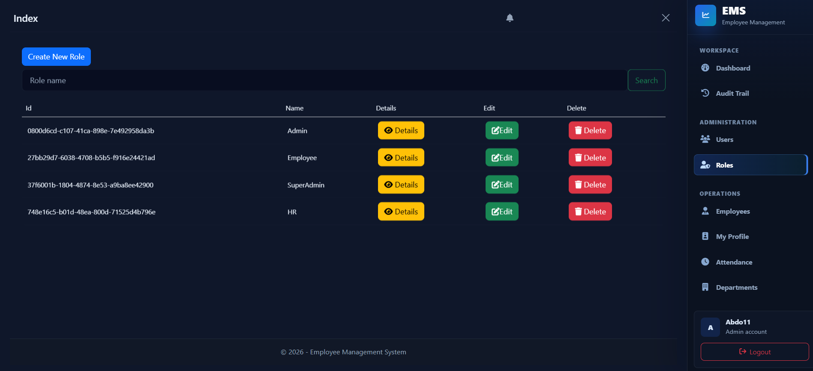
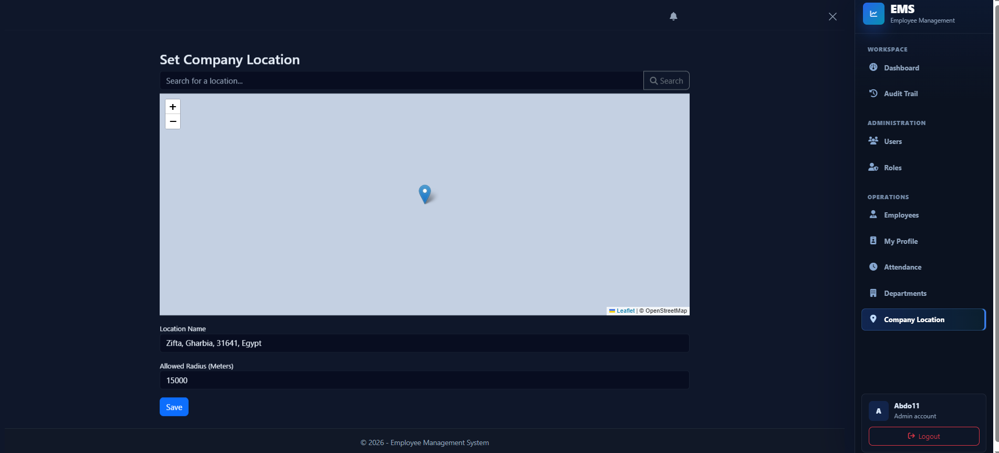
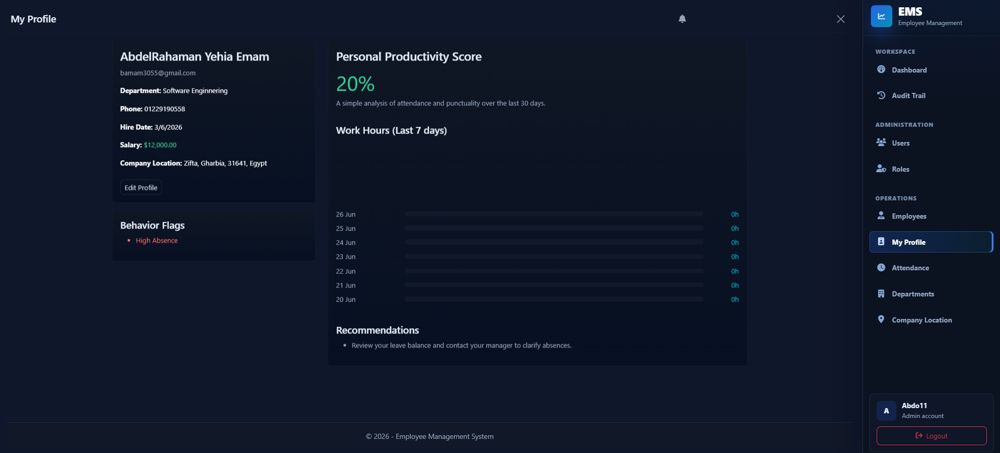
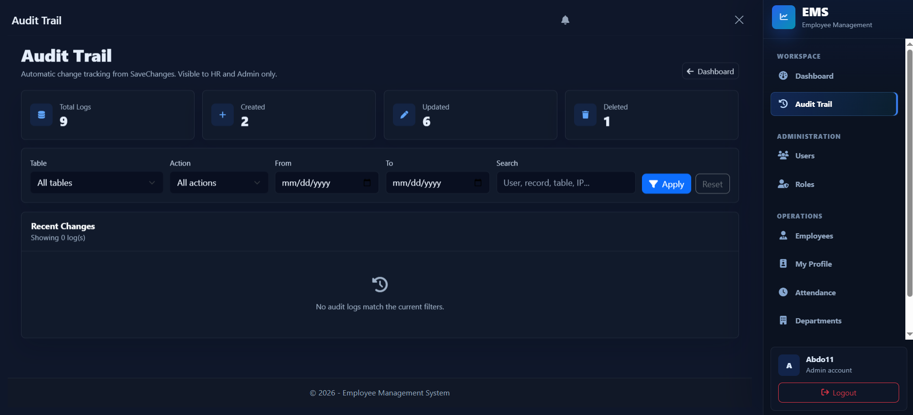

# EMS - Employee Management System

## Overview

EMS (Employee Management System) is a full-featured enterprise web application developed using **ASP.NET Core MVC**. The system streamlines employee management by providing modules for employee administration, attendance tracking, leave management, role-based authorization, audit logging, and real-time notifications.

The project follows a clean layered architecture and demonstrates best practices in enterprise application development using .NET technologies.

---

## Features

* Employee Management (CRUD)
* Department Management
* Attendance Tracking
* Leave Request Management
* User & Role Management
* Role-Based Authorization
* Authentication & Authorization using ASP.NET Core Identity
* Real-Time Notifications using SignalR
* Audit Logging
* Dashboard & Analytics
* Google Maps Integration for Company Locations
* Responsive User Interface

---

## Technologies Used

### Backend

* ASP.NET Core MVC (.NET 8)
* C#
* Entity Framework Core
* ASP.NET Core Identity
* SignalR
* AutoMapper

### Database

* SQL Server

### Frontend

* HTML5
* CSS3
* Bootstrap
* JavaScript
* jQuery

---

## Project Architecture

The project follows a **3-Layer Architecture**:

* **EMS.PL** – Presentation Layer
* **EMS.BLL** – Business Logic Layer
* **EMS.DAL** – Data Access Layer

---

## Getting Started

### Prerequisites

* Visual Studio 2022
* .NET 8 SDK
* SQL Server

### Installation

Clone the repository:

```bash
git clone https://github.com/AbdelrahmanYehiaGharib23/EMS-Employee-Management-System.git
```

Update the connection string inside:

```text
appsettings.json
```

Apply database migrations:

```powershell
Update-Database
```

Run the project:

```bash
dotnet run
```

---

# Screenshots

## Login



---

## Dashboard



---

## Employee Management



---

## Department Management



---

## Attendance Management



---

## User Management



---

## Roles Management



---

## Company Locations



---

## User Profile



---

## Audit Trail



---

## Future Enhancements

* Email Notifications
* Advanced Reporting
* Payroll Management
* Performance Evaluation
* REST API Integration
* Docker Support

---

## Author

**Abdelrahman Yehia Gharib**

GitHub:
https://github.com/AbdelrahmanYehiaGharib23

